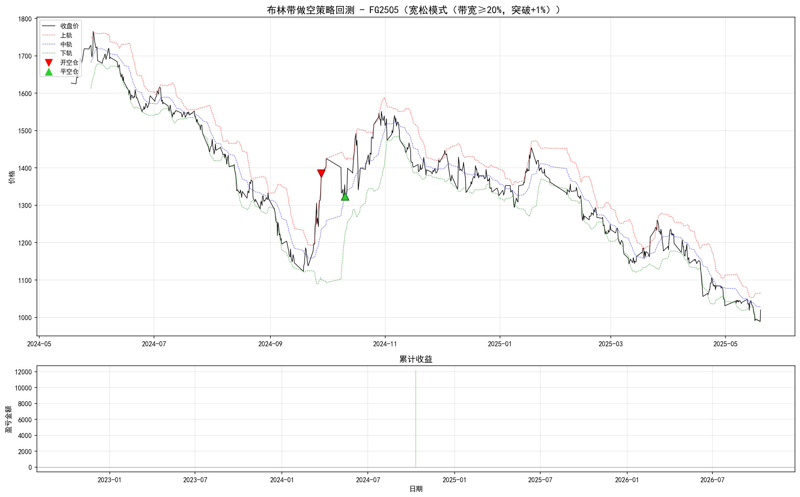

# 布林带做空策略 - 批量回测报告

> 生成时间: 2026-04-26 22:08:40

## 一、策略参数

| 参数 | 严谨模式 | 宽松模式 | 说明 |
|------|---------|---------|------|
| 布林带周期 | 20 | 20 | SMA 周期 |
| 标准差倍数 | 2.0 | 2.0 | BB 上下轨偏移 |
| 带宽阈值 | 0.25 (25%) | 0.20 (20%) | (上轨-下轨)/中轨 > 此值 |
| 突破阈值 | 0.02 (+2%) | 0.01 (+1%) | 收盘价 > 上轨×(1+此值) |
| 趋势斜率窗口 | 3 | 3 | 最近3根K线斜率>0 |
| 每次开仓手数 | 10 | 10 | 固定仓位 |
| 手续费率 | 0.0001 | 0.0001 | 按金额万分之几计 |

### 开仓条件（做空）
1. 布林带趋势确认：最近3根K线，上轨和下轨斜率同时 > 0
2. 布林带带宽 > 阈值（严谨25%，宽松20%）
3. 收盘价突破上轨 × (1+突破阈值)（严谨+2%，宽松+1%）

### 平仓条件
- 价格回落到布林带中轨以下时平仓

## 二、汇总总览 - 严谨模式（带宽≥25%，突破+2%）

| # | 品种 | 交易所 | 数据范围 | 记录数 | 最大带宽 | 带宽达标% | 交易笔数 | 总盈亏 | 胜率 |
|---|------|--------|---------|--------|---------|----------|---------|--------|------|
| 1 | CF2505 | CZCE | 2024-05-17~2025-05-19 | 719 | 0.1245 | 0.0% | **0** | - | - |
| 2 | FG2505 | CZCE | 2024-05-17~2025-05-19 | 719 | 0.2666 | 0.4% | **0** | - | - |
| 3 | IC2603 | CFFEX | 2025-07-21~2026-03-20 | 322 | 0.1653 | 0.0% | **0** | - | - |
| 4 | IF2603 | CFFEX | 2025-07-21~2026-03-20 | 322 | 0.1070 | 0.0% | **0** | - | - |
| 5 | IH2603 | CFFEX | 2025-07-21~2026-03-20 | 322 | 0.0868 | 0.0% | **0** | - | - |
| 6 | IM2603 | CFFEX | 2025-07-21~2026-03-20 | 322 | 0.1571 | 0.0% | **0** | - | - |
| 7 | MA2505 | CZCE | 2024-05-17~2025-05-19 | 713 | 0.1141 | 0.0% | **0** | - | - |
| 8 | RM2505 | CZCE | 2024-05-17~2025-05-19 | 711 | 0.1677 | 0.0% | **0** | - | - |
| 9 | SA2505 | CZCE | 2024-05-17~2025-05-19 | 716 | 0.3169 | 1.0% | **0** | - | - |
| 10 | SR2505 | CZCE | 2024-05-17~2025-05-16 | 709 | 0.0631 | 0.0% | **0** | - | - |
| 11 | T2506 | CFFEX | 2024-09-18~2025-06-13 | 522 | 0.0277 | 0.0% | **0** | - | - |
| 12 | TA2505 | CZCE | 2024-05-17~2025-05-19 | 719 | 0.2739 | 0.8% | **0** | - | - |
| 13 | TF2506 | CFFEX | 2024-09-18~2025-06-13 | 521 | 0.0156 | 0.0% | **0** | - | - |
| 14 | TS2506 | CFFEX | 2024-09-18~2025-06-12 | 523 | 0.0054 | 0.0% | **0** | - | - |
| 15 | a2505 | DCE | 2024-05-17~2025-05-13 | 700 | 0.0758 | 0.0% | **0** | - | - |
| 16 | ag2606 | SHFE | 2025-06-16~2026-04-10 | 988 | 0.5828 | 6.1% | **0** | - | - |
| 17 | al2506 | SHFE | 2024-06-18~2025-06-16 | 898 | 0.0950 | 0.0% | **0** | - | - |
| 18 | au2506 | SHFE | 2024-05-15~2025-06-16 | 1292 | 0.0854 | 0.0% | **0** | - | - |
| 19 | bu2506 | SHFE | 2023-06-16~2025-06-16 | 1267 | 0.2032 | 0.0% | **0** | - | - |
| 20 | c2505 | DCE | 2024-05-17~2025-05-19 | 713 | 0.0624 | 0.0% | **0** | - | - |
| 21 | cs2505 | DCE | 2024-05-20~2025-05-19 | 707 | 0.0439 | 0.0% | **0** | - | - |
| 22 | cu2506 | SHFE | 2024-06-17~2025-06-16 | 945 | 0.1823 | 0.0% | **0** | - | - |
| 23 | hc2506 | SHFE | 2024-06-19~2025-06-11 | 584 | 0.2017 | 0.0% | **0** | - | - |
| 24 | i2505 | DCE | 2024-05-17~2025-05-19 | 715 | 0.2615 | 0.4% | **0** | - | - |
| 25 | m2505 | DCE | 2024-05-17~2025-05-19 | 719 | 0.1409 | 0.0% | **0** | - | - |
| 26 | ni2506 | SHFE | 2024-06-18~2025-06-16 | 849 | 0.1633 | 0.0% | **0** | - | - |
| 27 | p2505 | DCE | 2024-05-17~2025-05-19 | 704 | 0.1240 | 0.0% | **0** | - | - |
| 28 | rb2601 | SHFE | 2025-01-15~2026-01-15 | 716 | 0.0897 | 0.0% | **0** | - | - |
| 29 | ru2506 | SHFE | 2024-06-18~2025-06-16 | 634 | 0.2501 | 0.2% | **0** | - | - |
| 30 | y2505 | DCE | 2024-05-17~2025-05-19 | 702 | 0.1166 | 0.0% | **0** | - | - |
| 31 | zn2506 | SHFE | 2024-06-17~2025-06-16 | 888 | 0.1091 | 0.0% | **0** | - | - |

## 二、汇总总览 - 宽松模式（带宽≥20%，突破+1%）

| # | 品种 | 交易所 | 数据范围 | 记录数 | 最大带宽 | 带宽达标% | 交易笔数 | 总盈亏 | 胜率 |
|---|------|--------|---------|--------|---------|----------|---------|--------|------|
| 1 | CF2505 | CZCE | 2024-05-17~2025-05-19 | 719 | 0.1245 | 0.0% | **0** | - | - |
| 2 | FG2505 | CZCE | 2024-05-17~2025-05-19 | 719 | 0.2666 | 1.0% | **1** | +12,145.8 | 100.0% |
| 3 | IC2603 | CFFEX | 2025-07-21~2026-03-20 | 322 | 0.1653 | 0.0% | **0** | - | - |
| 4 | IF2603 | CFFEX | 2025-07-21~2026-03-20 | 322 | 0.1070 | 0.0% | **0** | - | - |
| 5 | IH2603 | CFFEX | 2025-07-21~2026-03-20 | 322 | 0.0868 | 0.0% | **0** | - | - |
| 6 | IM2603 | CFFEX | 2025-07-21~2026-03-20 | 322 | 0.1571 | 0.0% | **0** | - | - |
| 7 | MA2505 | CZCE | 2024-05-17~2025-05-19 | 713 | 0.1141 | 0.0% | **0** | - | - |
| 8 | RM2505 | CZCE | 2024-05-17~2025-05-19 | 711 | 0.1677 | 0.0% | **0** | - | - |
| 9 | SA2505 | CZCE | 2024-05-17~2025-05-19 | 716 | 0.3169 | 1.7% | **0** | - | - |
| 10 | SR2505 | CZCE | 2024-05-17~2025-05-16 | 709 | 0.0631 | 0.0% | **0** | - | - |
| 11 | T2506 | CFFEX | 2024-09-18~2025-06-13 | 522 | 0.0277 | 0.0% | **0** | - | - |
| 12 | TA2505 | CZCE | 2024-05-17~2025-05-19 | 719 | 0.2739 | 1.5% | **0** | - | - |
| 13 | TF2506 | CFFEX | 2024-09-18~2025-06-13 | 521 | 0.0156 | 0.0% | **0** | - | - |
| 14 | TS2506 | CFFEX | 2024-09-18~2025-06-12 | 523 | 0.0054 | 0.0% | **0** | - | - |
| 15 | a2505 | DCE | 2024-05-17~2025-05-13 | 700 | 0.0758 | 0.0% | **0** | - | - |
| 16 | ag2606 | SHFE | 2025-06-16~2026-04-10 | 988 | 0.5828 | 9.3% | **0** | - | - |
| 17 | al2506 | SHFE | 2024-06-18~2025-06-16 | 898 | 0.0950 | 0.0% | **0** | - | - |
| 18 | au2506 | SHFE | 2024-05-15~2025-06-16 | 1292 | 0.0854 | 0.0% | **0** | - | - |
| 19 | bu2506 | SHFE | 2023-06-16~2025-06-16 | 1267 | 0.2032 | 0.3% | **0** | - | - |
| 20 | c2505 | DCE | 2024-05-17~2025-05-19 | 713 | 0.0624 | 0.0% | **0** | - | - |
| 21 | cs2505 | DCE | 2024-05-20~2025-05-19 | 707 | 0.0439 | 0.0% | **0** | - | - |
| 22 | cu2506 | SHFE | 2024-06-17~2025-06-16 | 945 | 0.1823 | 0.0% | **0** | - | - |
| 23 | hc2506 | SHFE | 2024-06-19~2025-06-11 | 584 | 0.2017 | 0.3% | **0** | - | - |
| 24 | i2505 | DCE | 2024-05-17~2025-05-19 | 715 | 0.2615 | 1.1% | **0** | - | - |
| 25 | m2505 | DCE | 2024-05-17~2025-05-19 | 719 | 0.1409 | 0.0% | **0** | - | - |
| 26 | ni2506 | SHFE | 2024-06-18~2025-06-16 | 849 | 0.1633 | 0.0% | **0** | - | - |
| 27 | p2505 | DCE | 2024-05-17~2025-05-19 | 704 | 0.1240 | 0.0% | **0** | - | - |
| 28 | rb2601 | SHFE | 2025-01-15~2026-01-15 | 716 | 0.0897 | 0.0% | **0** | - | - |
| 29 | ru2506 | SHFE | 2024-06-18~2025-06-16 | 634 | 0.2501 | 1.6% | **0** | - | - |
| 30 | y2505 | DCE | 2024-05-17~2025-05-19 | 702 | 0.1166 | 0.0% | **0** | - | - |
| 31 | zn2506 | SHFE | 2024-06-17~2025-06-16 | 888 | 0.1091 | 0.0% | **0** | - | - |

## 三、数据分析

- 总品种数: **31**
- 严谨模式有信号: **0** 个品种
- 宽松模式有信号: **1** 个品种

### 未触发信号的原因分析

所有品种的布林带最大带宽统计：

| 带宽范围 | 品种数 | 品种 |
|---------|--------|------|
| 带宽 > 0.25 | 6 | FG2505, SA2505, TA2505, ag2606, i2505, ru2506 |
| 0.20 ~ 0.25 | 2 | bu2506, hc2506 |
| 0.15 ~ 0.20 | 5 | IC2603, IM2603, RM2505, cu2506, ni2506 |
| < 0.15 | 18 | CF2505, IF2603, IH2603, MA2505, SR2505, T2506, TF2506, TS2506, a2505, al2506, au2506, c2505, cs2505, m2505, p2505, rb2601, y2505, zn2506 |

## 四、有交易信号的品种 - 宽松模式（带宽≥20%，突破+1%）

### FG2505（CZCE）

- 数据范围: 2024-05-17 ~ 2025-05-19（719 条记录）
- 合约乘数: 20
- 最大带宽: 0.2666
- 交易笔数: 1
- 盈利/亏损: 1/0
- 胜率: 100.0%
- 总盈亏: +12,145.8 元
- 最大单笔盈利: +12,145.8 元
- 最大单笔亏损: +12,145.8 元
- 最大回撤: +0.0 元
- 平均持仓天数: 12.0 天

交易明细:

| # | 开仓日期 | 开仓价 | 平仓日期 | 平仓价 | 手数 | 持仓天数 | 点数盈亏 | 手续费 | 净盈亏 |
|---|---------|--------|---------|--------|------|---------|---------|--------|--------|
| 1 | 2024-09-27 | 1,385 | 2024-10-10 | 1,324 | 10 | 12 | +61.0 | 54.2 | +12,145.8 |

## 五、结论与建议

### 1. 策略逻辑更新
- 采用**斜率趋势确认**替代原有的单根比较（上轨>上一根 + 下轨>上一根）
- 使用最近3根K线的上下轨斜率同时>0作为趋势过滤，减少噪音信号
- 移除了连续阳线计数逻辑，简化了开仓条件

### 2. 两种模式对比
- 严谨模式（带宽25%+突破2%）：0 个品种产生信号
- 宽松模式（带宽20%+突破1%）：1 个品种产生信号

### 3. 数据周期影响
- 该策略为 **2 小时K线周期** 设计，本次回测使用的是 **日线(D1)** 数据
- 日线波动率天然低于日内K线，导致带宽很难达到阈值

### 4. 推荐测试方案
- 使用 InfiniTrader 导出 **2 小时(M120) 或 1 小时(H1)** K线数据
- 品种优先选择: ag（白银）、FG（玻璃）、SA（纯碱）、ru（橡胶）、i（铁矿）
